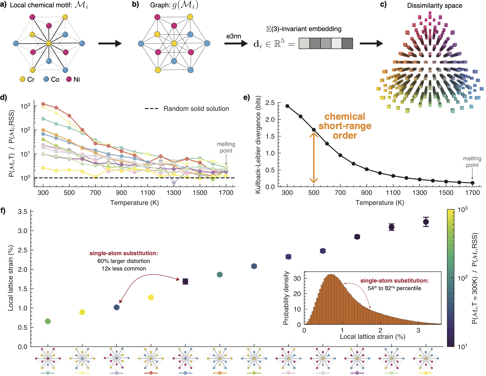

# ChemicalMotifIdentifier


This repository contains the codes necessary to perform a chemical-motif characterization of short-range order, as described in ``https://arxiv.org/abs/2311.01545'' and ``link_to_follow''. 

This framework allows for correlating any per-atom property to their local chemical motif. It also allows for the determining of predictive short-range chemical fluctuations length scale.

The framework is based on equivariant graph neural networks to ensure complete accuracy in the motif identification, any motifs that can be seen in a fcc, bcc or hcp solid solution with up to 5 chemical elements can be identified with 100% accuracy. 




## Instalation 

```bash
# To install the latest PyPi release
pip install chemicalmotifidentifier

# To install the latest git commit 
pip install htpps://github.com/killiansheriff/ChemicalMotifIdentifier.git
```

## Example of usage

```python 
from eca import ECA_MD

structure='fcc'
dump_files = glob.glob('*.dump')

eca = ECA_MD(crystal_structure=structure)
for i, dump_file in enumerate(dump_files):
    root = f'data/eca_id/dump_{i}/'
    df = eca.predict(root=root, dump_file=dump_file)
    kl = eca.get_kl(df)
    df.to_pickle(root+'df_microstates.pkl')
```

A jupyter notebook presenting a few test cases can be found in the ``examples/`` folder.

